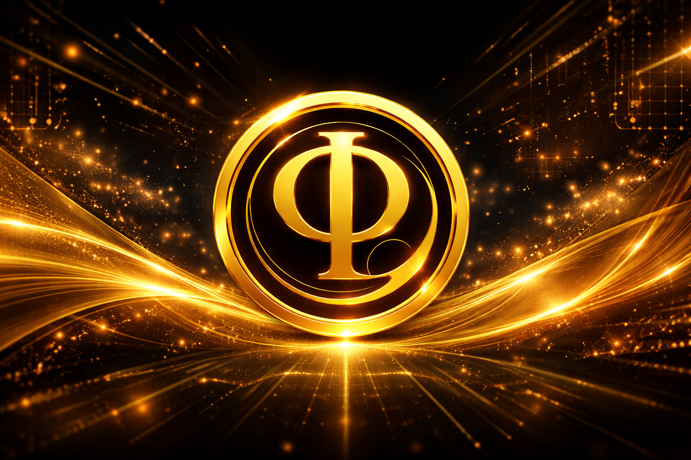

<p align="center">
  
</p>

<h1 align="center">PhiQuence (PHI)</h1>

<p align="center">
  True Balance. Real Growth.
</p>

<p align="center">
  
</p>

---

## 🚀 Overview

PhiQuence is a next-generation community-driven DeFi ecosystem built on the BNB Smart Chain.  
Focused on transparency, sustainability, and long-term growth, PhiQuence empowers users through decentralized financial infrastructure.

---

## 🔥 Community Takeover (CTO)

PhiQuence is now fully under Community Takeover (CTO).  
The original developer is no longer active, and the community has taken full control of the project.

This ensures:
- Transparency  
- Community ownership  
- Sustainable long-term development  

---

## 📊 Token Information

- **Name:** PhiQuence  
- **Symbol:** PHI  
- **Network:** BNB Smart Chain  
- **Contract Address:**  
  `0x82A375883c5E402D6D95436C0415bAE0a2c7645`

---

## 🔗 Official Links

- 🌐 Website: https://phiquence.com  
- 🌐 Website 2: https://phiquence.online  
- 📢 Telegram: https://t.me/phiquence  
- 🐦 Twitter (X): https://x.com/phiquence  
- 📸 Instagram: https://instagram.com/phiquence  
- ▶️ YouTube: https://youtube.com/@Phiquence  
- 🔍 BscScan: https://bscscan.com/0x82A375883c5E402D6D95436C0415bAE0a2c7645  

---

## ⚙️ Features

- ERC20 Standard  
- Burnable Mechanism  
- Pausable Contract  
- Permit (EIP-2612)  
- Role-Based Access Control  

---

## 📁 Repository Structure

```bash
contracts/        # Smart contracts
assets/           # Logo & banner
README.md         # Project overview
